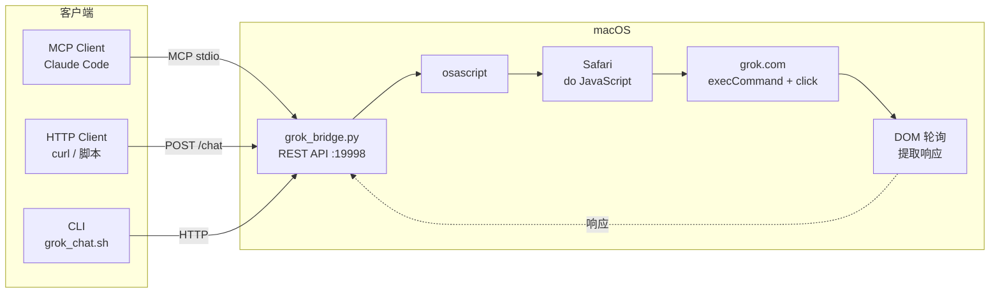

# supergrok-bridge

将 **SuperGrok** 变成 REST API + MCP Server，无需 API Key。

> 本项目基于 [ythx-101/grok-bridge](https://github.com/ythx-101/grok-bridge)。由于原项目已较长时间未维护，积压的 PR 和 Bug 未得到处理，因此新开此仓库独立维护。在原有基础上修复了 grok.com UI 变更导致的兼容性问题，并新增了 MCP Server 支持。

[English](README_EN.md)

## 工作原理

```
终端/脚本/MCP Client → Safari JS 注入 → grok.com → DOM 提取响应
```

通过 AppleScript 向 Safari 注入 JavaScript，实现与 grok.com 的自动化交互。无需 API Key，无需额外权限，纯 JS 注入。

## 三种使用方式

### 1. MCP Server（推荐）

将 Grok 集成到 Claude Code 等 MCP 客户端中，作为工具直接调用。


```bash
# 注册到 Claude Code（需先启动 REST API 服务）
claude mcp add --scope user grok-mcp -- python3 /path/to/scripts/grok_mcp.py
```

提供以下工具：

| 工具 | 说明 |
|------|------|
| `grok_chat` | 开启**新对话**并发送消息（历史保留在 Grok 侧） |
| `grok_continue_chat` | 在**当前对话**中继续追问 |
| `grok_history` | 读取当前对话的完整内容 |

### 2. REST API

```bash
# 启动服务
python3 scripts/grok_bridge.py --port 19998

# 发送消息
curl -X POST http://localhost:19998/chat \
  -H "Content-Type: application/json" \
  -d '{"prompt":"太阳的质量是多少？","timeout":60}'

# 新开对话
curl -X POST http://localhost:19998/new

# 健康检查
curl http://localhost:19998/health

# 读取当前对话
curl http://localhost:19998/history
```

### 3. CLI

```bash
# 本地调用
bash scripts/grok_chat.sh "解释量子隧穿效应"

# 通过 SSH 远程调用
MAC_SSH="ssh user@your-mac" bash scripts/grok_chat.sh "写一首俳句" --timeout 90
```

## 前置条件

- macOS + Safari
- 已登录 [grok.com](https://grok.com)（免费版或 SuperGrok 均可）
- Safari > 设置 > 高级 > 勾选「显示网页开发者功能」
- Safari > 开发 > 勾选「允许来自 Apple Events 的 JavaScript」
- **无需辅助功能权限**（v3 使用纯 JS 注入）

## 建议

- Safari 中为 grok.com 开一个独立窗口并最小化，日常浏览用另一个窗口
- 使用 launchd 守护进程保持 REST API 服务常驻：

```bash
# 创建 plist（按需修改路径）
cat > ~/Library/LaunchAgents/com.grok-bridge.plist << 'EOF'
<?xml version="1.0" encoding="UTF-8"?>
<!DOCTYPE plist PUBLIC "-//Apple//DTD PLIST 1.0//EN" "http://www.apple.com/DTDs/PropertyList-1.0.dtd">
<plist version="1.0">
<dict>
    <key>Label</key>
    <string>com.grok-bridge</string>
    <key>ProgramArguments</key>
    <array>
        <string>/usr/bin/python3</string>
        <string>/path/to/scripts/grok_bridge.py</string>
        <string>--port</string>
        <string>19998</string>
    </array>
    <key>RunAtLoad</key>
    <true/>
    <key>KeepAlive</key>
    <true/>
    <key>StandardOutPath</key>
    <string>/tmp/grok-bridge.log</string>
    <key>StandardErrorPath</key>
    <string>/tmp/grok-bridge.err</string>
</dict>
</plist>
EOF

# 加载服务
launchctl load ~/Library/LaunchAgents/com.grok-bridge.plist
```

## API 接口

| 方法 | 路径 | 说明 |
|------|------|------|
| POST | `/chat` | 发送消息，等待响应 |
| POST | `/new` | 新开对话 |
| GET | `/health` | 健康检查 |
| GET | `/history` | 读取当前页面对话内容 |

## 架构



## 技术要点

React 受控组件会忽略 JavaScript 的 `value` setter、合成 `InputEvent` 以及 `nativeInputValueSetter`。

无法工作的方案：
- `osascript keystroke` — 被 macOS 辅助功能权限阻止
- CGEvent (Swift) — HID 事件无法到达 Web 内容
- JS `InputEvent` / `nativeInputValueSetter` — React 忽略合成事件

可行的方案：
- `document.execCommand('insertText')` — 触发浏览器原生输入
- JS `button.click()` — 直接点击发送按钮，无需 System Events
- 插入文本后 `dispatchEvent(new Event('input'))` — 同步 React 状态

## 与原项目的差异

基于 [ythx-101/grok-bridge](https://github.com/ythx-101/grok-bridge) v3（REST API + JS 注入架构），本项目新增和修复：

- 修复 grok.com UI 变更：Submit 按钮选择器、输入框优先级、React 状态同步
- 修复 HTTP 响应缺少 Content-Length 导致客户端挂起
- 新增 MCP Server，支持 Claude Code 等 MCP 客户端直接调用

## 致谢

- 原项目：[ythx-101/grok-bridge](https://github.com/ythx-101/grok-bridge)
- v3 架构设计：Claude Opus 4.6 (via [Antigravity](https://antigravity.so))
- System Events 绕过方案：小灵

## License

MIT
