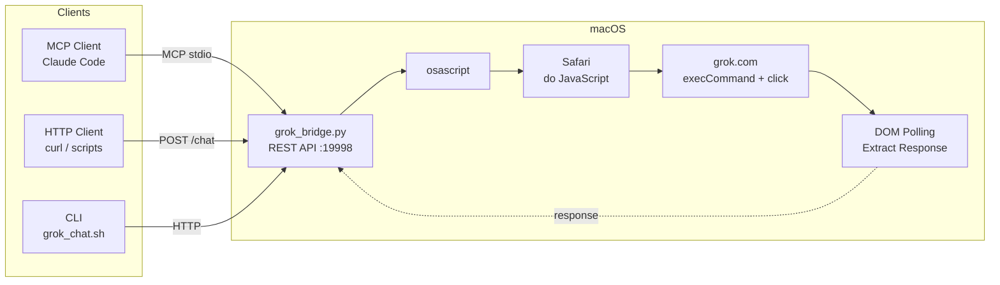

# supergrok-bridge

Turn **SuperGrok** into a REST API + MCP Server. No API key needed.

> This project is based on [ythx-101/grok-bridge](https://github.com/ythx-101/grok-bridge). The original repo has been inactive for a while with pending PRs and bugs unaddressed, so this repo was created for independent maintenance. It fixes compatibility issues caused by grok.com UI changes and adds MCP Server support.

[中文文档](README.md)

## How it works

```
Terminal/Script/MCP Client → Safari JS injection → grok.com → Response extracted via DOM
```

Uses AppleScript to inject JavaScript into Safari for automated interaction with grok.com. No API key, no extra permissions, pure JS injection.

## Three ways to use

### 1. MCP Server (recommended)

Integrate Grok into Claude Code or other MCP clients as callable tools.


```bash
# Register with Claude Code (requires REST API service running)
claude mcp add --scope user grok-mcp -- python3 /path/to/scripts/grok_mcp.py
```

Available tools:

| Tool | Description |
|------|-------------|
| `grok_chat` | Start a **new conversation** and send a message (history preserved in Grok) |
| `grok_continue_chat` | Continue asking in the **current conversation** |
| `grok_history` | Read the full content of the current conversation |

### 2. REST API

```bash
# Start the server
python3 scripts/grok_bridge.py --port 19998

# Send a message
curl -X POST http://localhost:19998/chat \
  -H "Content-Type: application/json" \
  -d '{"prompt":"What is the mass of the sun?","timeout":60}'

# Start new conversation
curl -X POST http://localhost:19998/new

# Health check
curl http://localhost:19998/health

# Read current conversation
curl http://localhost:19998/history
```

### 3. CLI

```bash
# Local
bash scripts/grok_chat.sh "Explain quantum tunneling"

# Remote via SSH
MAC_SSH="ssh user@your-mac" bash scripts/grok_chat.sh "Write a haiku" --timeout 90
```

## Requirements

- macOS + Safari
- Logged into [grok.com](https://grok.com) (free or SuperGrok)
- Safari > Settings > Advanced > Show features for web developers
- Safari > Develop > Allow JavaScript from Apple Events
- **No Accessibility permission needed** (v3 uses pure JS injection)

## Tips

- Keep a dedicated Safari window open with grok.com, minimized. Use another window for browsing.
- Use launchd to keep the REST API service running as a daemon:

```bash
# Create plist (adjust paths as needed)
cat > ~/Library/LaunchAgents/com.supergrok-bridge.plist << 'EOF'
<?xml version="1.0" encoding="UTF-8"?>
<!DOCTYPE plist PUBLIC "-//Apple//DTD PLIST 1.0//EN" "http://www.apple.com/DTDs/PropertyList-1.0.dtd">
<plist version="1.0">
<dict>
    <key>Label</key>
    <string>com.supergrok-bridge</string>
    <key>ProgramArguments</key>
    <array>
        <string>/usr/bin/python3</string>
        <string>/path/to/scripts/grok_bridge.py</string>
        <string>--port</string>
        <string>19998</string>
    </array>
    <key>RunAtLoad</key>
    <true/>
    <key>KeepAlive</key>
    <true/>
    <key>StandardOutPath</key>
    <string>/tmp/supergrok-bridge.log</string>
    <key>StandardErrorPath</key>
    <string>/tmp/supergrok-bridge.err</string>
</dict>
</plist>
EOF

# Load the service
launchctl load ~/Library/LaunchAgents/com.supergrok-bridge.plist
```

## API Endpoints

| Method | Path | Description |
|--------|------|-------------|
| POST | `/chat` | Send a prompt, wait for response |
| POST | `/new` | Start a new conversation |
| GET | `/health` | Health check |
| GET | `/history` | Read current page conversation |

## Architecture



## Key Technical Insight

React controlled inputs ignore JavaScript `value` setter, synthetic `InputEvent`, and `nativeInputValueSetter`.

What doesn't work:
- `osascript keystroke` — blocked by macOS Accessibility permissions
- CGEvent (Swift) — HID events don't reach web content
- JS `InputEvent` / `nativeInputValueSetter` — React ignores synthetic events

What works:
- `document.execCommand('insertText')` — triggers real browser input
- JS `button.click()` — clicks Send button directly, no System Events needed
- `dispatchEvent(new Event('input'))` after insert — syncs React state

## Differences from the original

Based on [ythx-101/grok-bridge](https://github.com/ythx-101/grok-bridge) v3 (REST API + JS injection architecture), this project adds and fixes:

- Fix grok.com UI changes: Submit button selector, input element priority, React state sync
- Fix HTTP response missing Content-Length causing client hang
- Add MCP Server for Claude Code and other MCP clients

## Credits

- Original project: [ythx-101/grok-bridge](https://github.com/ythx-101/grok-bridge)
- v3 architecture: Claude Opus 4.6 (via [Antigravity](https://antigravity.so))
- System Events bypass: xiaoling

## License

MIT
